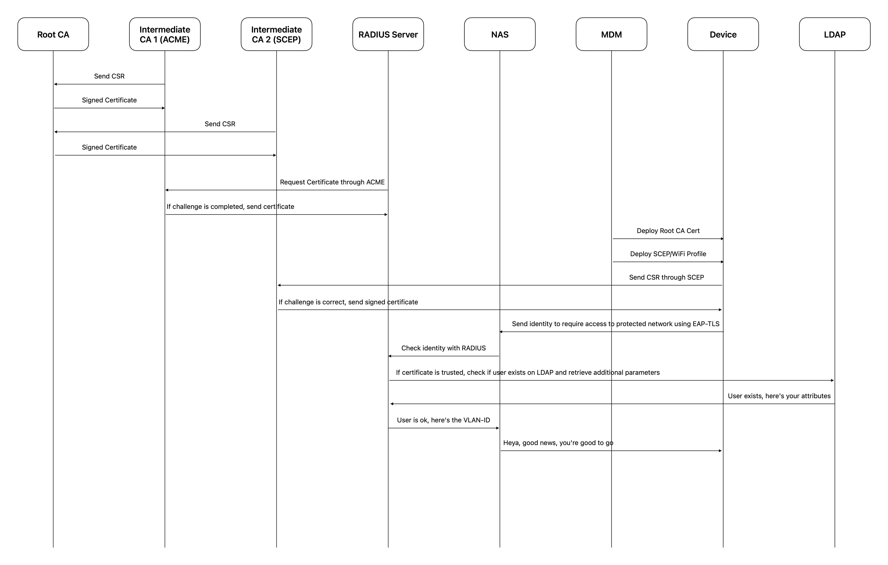

# The Flow
{: .no_toc }

---

I tried to put together a simplified diagram for all flows.

I’d like to underline that this is simplified, in fact there’s much more happening on each communication between two parts, it’s not just one back and forth, there are TLS handshakes to establish encrypted tunnels for example, SCEP itself requires at least 2 GET and 1 POST requests from the client perspective, with the relative replies; but anyway, this is just to outline the functionality of what we’ll build, so you’ll forgive me if there are not all the details, but it’d have required at least 3-4 times the space to draw all.

